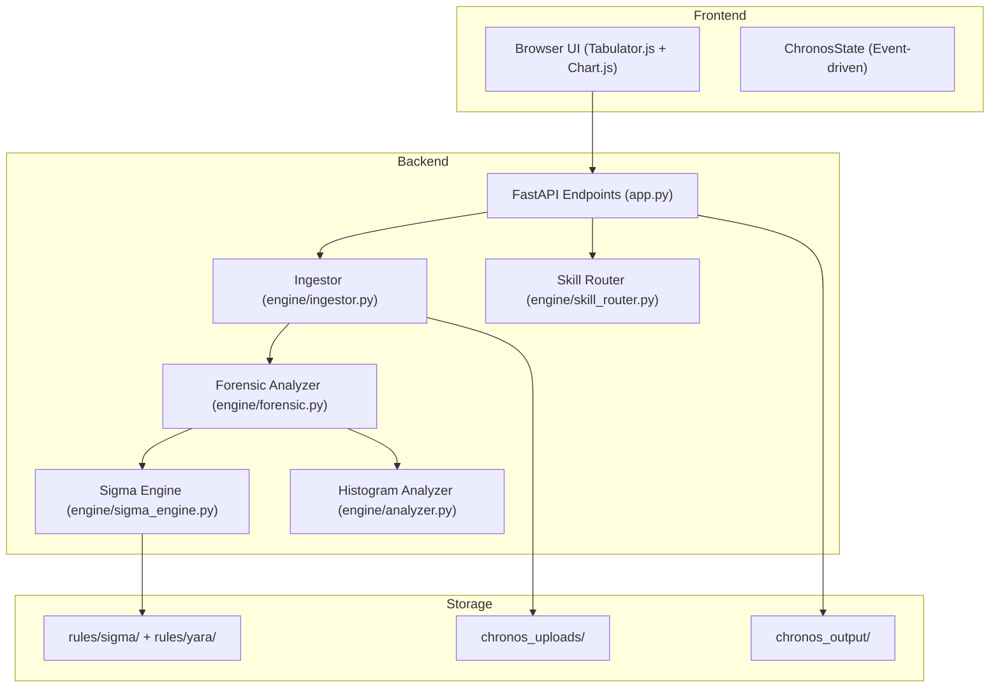

## Overview

Chronos-DFIR is built as a **forensic timeline explorer** designed for digital forensics and incident response (DFIR) analysts. The platform ingests multi-format evidence (EVTX, CSV, MFT, Plist, XLSX), applies Sigma/YARA detection rules, and renders interactive timelines with risk-scored intelligence.

<Note>
  The entire backend is async-first with streaming I/O to handle datasets exceeding 6GB without blocking the event loop.
</Note>

---

## Tech Stack

The application is built on a modern, performance-optimized stack targeting **Apple Silicon M4** hardware with ARM NEON and unified memory optimizations.

<Accordion title="Backend Stack">
  | Component | Technology | Constraint |
  |-----------|-----------|------------|
  | **Runtime** | Python 3.12+ | Async-first architecture |
  | **Web Framework** | FastAPI + uvicorn | Async endpoints, streaming responses |
  | **Data Engine** | Polars (vectorized) + PyArrow | **NEVER** use Pandas. All transforms must be vectorized Polars expressions |
  | **Detection** | Sigma YAML + YARA rules | Standard format only, loaded from `rules/sigma/` and `rules/yara/` |
  | **Exports** | WeasyPrint, Playwright, xhtml2pdf | Multi-format: PDF, HTML standalone, CSV, XLSX, JSON |
</Accordion>

<Accordion title="Frontend Stack">
  | Component | Technology | Purpose |
  |-----------|-----------|----------|
  | **Grid Rendering** | Tabulator.js (virtual DOM) | Handles 500K+ rows with pagination and column virtualization |
  | **Charts** | Chart.js | Interactive histograms, distribution analysis |
  | **State Management** | Custom event-driven (`ChronosState`) | Filters, selections, time ranges |
  | **Performance** | CSS GPU hints (`will-change`, `content-visibility`) | Minimize main-thread computation |
</Accordion>

<Warning>
  **Hard Rule**: All file I/O for datasets > 50MB **must** use streaming (`scan_csv`, `scan_parquet`, `sink_csv`). Never load large files into memory with `.collect()` until aggregated.
</Warning>

---

## System Architecture Diagram



---

## Core Engine Modules

The backend follows a **modular engine architecture** with clear separation of concerns. As of v180, `app.py` was decomposed from 2,160 lines to 1,528 lines by extracting parsing and analysis logic.

### Module Breakdown

<Accordion title="engine/forensic.py (~1,426 lines)">
  **Purpose**: Core forensic analysis engine with sub-analyzers for timeline, context, hunting, identity, and process analysis.

  **Key Functions**:
  - `get_primary_time_column()` — Standardized time column detection using `TIME_HIERARCHY`
  - `parse_time_boundary()` — Robust parsing of start/end times from frontend
  - `sanitize_context_data()` — Forensic integrity checks (EventID validation, no fabricated timestamps)
  - `sub_analyze_timeline()` — Top events, top tactics, time range extraction
  - `sub_analyze_context()` — IPs, users, hosts, paths, violations
  - `sub_analyze_hunting()` — Suspicious patterns, network anomalies, logon analysis
  - `sub_analyze_identity_and_procs()` — Top/rare processes, rare execution paths
  - `calculate_smart_risk_m4()` — Multi-factor risk scoring (Sigma hits, IOCs, rare behaviors)

  **Evidence Integrity Rules**:
  - Never mutate original timestamps, hex values, SIDs, or hashes
  - Never fabricate timestamps (emit `null` if no real FILETIME data exists)
  - Column `No.` is cosmetic — renumbered on display, never used as a foreign key

  Reference: `engine/forensic.py:1-1426`
</Accordion>

<Accordion title="engine/sigma_engine.py (~500 lines)">
  **Purpose**: Dynamic YAML-to-Polars rule evaluator. Translates Sigma detection rules into Polars LazyFrame expressions at runtime.

  **Capabilities (v1.2)**:
  - Field modifiers: `contains`, `endswith`, `startswith`, `re` (regex), `all`, `any`
  - Boolean conditions: `and`, `or`, `not` between detection blocks
  - EventID list matching (`is_in`)
  - Metadata extraction: `title`, `level`, `tags`, MITRE ATT&CK techniques
  - Temporal correlation: `timeframe`, `event_count`, `group_by`, `gte`
  - Custom aggregation blocks with time windows and thresholds

  **Current Limitations**:
  - `near` queries, `base64offset`, and `cidr` modifiers not yet supported
  - Temporal conditions (`timeframe`, `count`) partially implemented

  **Rules Coverage**: 86+ Sigma rules covering MITRE ATT&CK tactics TA0001-TA0011 + TA0040 (Impact) + OWASP Top 10.

  Reference: `engine/sigma_engine.py:1-500`
</Accordion>

<Accordion title="engine/ingestor.py (~370 lines)">
  **Purpose**: Multi-format file parser. Zero pandas dependency. Extracts data from 10+ formats.

  **Supported Formats**:
  - **Forensic artifacts**: EVTX (Windows Event Logs), MFT (Master File Table), Plist (macOS)
  - **Generic reports**: CSV, TSV, Excel (.xlsx), JSON/JSONL/NDJSON
  - **Databases**: SQLite (.db, .sqlite3)
  - **Big data**: Parquet (columnar format)
  - **Text logs**: TXT, LOG (unified logs, whitespace-delimited)
  - **Archives**: ZIP (Plist bundles only)

  **Key Functions**:
  - `ingest_file()` — Main entry point, returns `(LazyFrame, DataFrame, file_category)`
  - `_read_whitespace_csv()` — Handles pslist, ls-triage output without pandas
  - `_sanitize_plist_val()` — Converts plist bytes/datetime/nested structures to Polars-safe types

  **Streaming**: Uses `scan_parquet()`, `scan_csv()` for lazy loading. Only materializes with `.collect()` after aggregation.

  Reference: `engine/ingestor.py:1-370`
</Accordion>

<Accordion title="engine/analyzer.py (~251 lines)">
  **Purpose**: Histogram and time-series analysis. Generates chart data with trend analysis, anomaly detection, and distribution breakdowns.

  **Key Functions**:
  - `analyze_dataframe()` — Main histogram generator
    - Auto-detects time column using `TIME_HIERARCHY`
    - Parses 10+ datetime formats + epoch timestamps (seconds/milliseconds/microseconds)
    - Smart bucketing: minutes, hours, days, months, years (based on data span)
    - Computes mean, peak, trend analysis (alza/baja/estable)
  - `build_chronos_timeseries()` — Structured chart data with metadata (referenced in `timeline_skill.py`)

  **Performance Optimizations**:
  - Lazy execution with `.lazy().select()` to minimize memory
  - Streaming aggregation with `.collect(streaming=True)`
  - Vectorized Polars expressions (no Python loops)

  Reference: `engine/analyzer.py:1-251`
</Accordion>

<Accordion title="engine/skill_router.py (~300 lines)">
  **Purpose**: Central registry of all 76 skills with integration status tracking.

  **Skill Categories**:
  | Status | Count | Description |
  |--------|-------|-------------|
  | `active` | 10 | Production code in `engine/` or `app.py` |
  | `frontend` | 5 | Implemented in `static/js/` |
  | `rules` | 5 | Implemented via Sigma YAML or YARA |
  | `wired` | 4 | Code exists but not connected to endpoints |
  | `prompt_only` | 52 | System prompts for AI agents (not yet implemented) |

  **Key Functions**:
  - `get_skill_summary()` — Returns categorized skill dictionary
  - `get_high_priority_prompts()` — Identifies top 5 skills for next activation
  - `print_registry_report()` — CLI summary (run `python engine/skill_router.py`)

  Reference: `engine/skill_router.py:1-300`
</Accordion>

<Info>
  Run `python engine/skill_router.py` from the project root to see the current skill activation status and high-priority candidates.
</Info>

---

## Data Flow: Ingestion to Visualization

The typical lifecycle of evidence processing follows this sequence:

### 1. File Upload (Streaming)

```python
# app.py - Streaming upload for large files (6GB+)
@app.post("/api/upload")
async def upload_file(file: UploadFile):
    # SHA256 hash computed during streaming (zero extra I/O)
    hasher = hashlib.sha256()
    async with aiofiles.open(save_path, 'wb') as out_file:
        while content := await file.read(1024 * 1024):  # 1MB chunks
            await out_file.write(content)
            hasher.update(content)
    file_hash = hasher.hexdigest()
    # Return chain of custody metadata
```

<Note>
  **Chain of Custody**: SHA256 hash is computed during upload with zero additional disk I/O. Hash + file size returned in `chain_of_custody` field.
</Note>

### 2. File Parsing (Ingestor)

```python
# engine/ingestor.py
lf, df_eager, file_cat = ingest_file(file_path, ext)
# Returns LazyFrame for large files, DataFrame for small ones
```

**Format Detection**:
- File extension → Parser routing (`.evtx` → EVTX engine, `.csv` → Polars scan_csv)
- Special cases: whitespace-delimited TXT, SQLite table detection, Plist sanitization

### 3. Forensic Analysis (Parallel Tasks)

The `/api/forensic_report` endpoint runs **9 parallel async tasks** using `asyncio.gather()`:

```python
task_results = await asyncio.gather(
    asyncio.to_thread(sub_analyze_timeline, ...),      # Task 1
    asyncio.to_thread(sub_analyze_context, ...),       # Task 2
    asyncio.to_thread(sub_analyze_hunting, ...),       # Task 3
    asyncio.to_thread(sub_analyze_identity_and_procs, ...), # Task 4
    asyncio.to_thread(evaluate_sigma_rules, ...),      # Task 5
    asyncio.to_thread(scan_with_yara, ...),            # Task 6
    asyncio.to_thread(build_correlation_chains, ...),  # Task 7
    asyncio.to_thread(analyze_sessions, ...),          # Task 8
    asyncio.to_thread(calculate_smart_risk_m4, ...),   # Task 9
)
```

<Warning>
  CPU-bound Polars operations are wrapped in `asyncio.to_thread()` to prevent blocking the FastAPI event loop.
</Warning>

### 4. Sigma Rule Evaluation

```python
# engine/sigma_engine.py
def evaluate_sigma_rules(df: pl.DataFrame, rules: list) -> dict:
    sigma_hits = []
    for rule in rules:
        # Translate YAML detection block to Polars expressions
        expr = _build_detection_expr(rule['detection'], df.columns)
        matched_df = df.filter(expr)
        if len(matched_df) > 0:
            sigma_hits.append({
                'title': rule['title'],
                'level': rule['level'],
                'mitre_technique': rule.get('tags', []),
                'matched_rows': len(matched_df),
                'sample_evidence': matched_df.head(150),
                'all_row_ids': matched_df['_id'].to_list()[:500]
            })
    return sigma_hits
```

**Evidence Enrichment**: `FORENSIC_CONTEXT_COLUMNS` (27 key columns like `User`, `Process`, `IP`, `CommandLine`) are automatically added to evidence samples if present in the dataset.

Reference: `engine/sigma_engine.py:200-350`

### 5. Frontend Rendering

**Tabulator Grid** (Virtual DOM):
- Remote pagination: loads 1000 rows per page via AJAX (`/api/data/{filename}`)
- Persistent row selection: `_persistentSelectedIds` Set survives pagination
- Column filters: `headerFilterChanged` event emits `FILTERS_CHANGED` for chart sync

**Chart.js Histogram**:
- Receives pre-aggregated data from backend (`/api/histogram/{filename}`)
- Auto-scales to linear or log10 based on peak/mean ratio
- Syncs with filters: global search, time range, column filters, row selection

**State Management**:
```javascript
// static/js/state.js
const ChronosState = {
    currentFilename: null,
    selectedIds: new Set(),
    globalSearch: '',
    timeRange: { start: null, end: null },
    columnFilters: {}
};
// Events: FILTERS_CHANGED, SELECTION_CHANGED, TIME_RANGE_CHANGED, STATE_RESET
```

---

## Performance Optimizations

Chronos-DFIR is designed to handle **massive datasets** (500K+ events, 6GB+ files) with responsive UI.

<Accordion title="Backend Performance">
  1. **Streaming I/O**: `scan_csv()`, `scan_parquet()` → lazy loading, no memory spike
  2. **Vectorized Polars**: Zero Python loops over dataframes. All operations use `.filter()`, `.group_by()`, `.agg()`
  3. **Lazy Execution**: Only materialize with `.collect()` after filtering and aggregation
  4. **Async Threading**: CPU-bound Polars work wrapped in `asyncio.to_thread()` to avoid blocking
  5. **Cache-busting**: Auto-computed MD5 hash of JS/CSS assets prevents stale cache

  Reference: `CLAUDE.md:19-22` (Hard Rules)
</Accordion>

<Accordion title="Frontend Performance">
  1. **Virtual DOM**: Tabulator.js renders only visible rows (50-100 at a time)
  2. **CSS GPU Acceleration**:
     - `content-visibility: auto` on `.tabulator` (lazy render offscreen rows)
     - `will-change: transform` on `#chart-wrapper canvas` (GPU compositing)
  3. **Debouncing**: 1200ms debounce on filter changes to prevent request floods
  4. **Batch Redraw**: `table.blockRedraw()` / `table.restoreRedraw()` for column operations
  5. **Backend Aggregation**: Chart peak/mean calculated server-side (not in JS)

  Reference: `CLAUDE.md:148-149`, `CLAUDE.md:179-180`
</Accordion>

---

## Evidence Integrity Guarantees

Chronos-DFIR follows **Zimmerman Logic** for forensic artifact handling:

<Warning>
  **NON-NEGOTIABLE RULES**:
  - Never mutate original evidence metadata (timestamps, hex values, SIDs, hashes)
  - Never fabricate timestamps — emit `null` if parser lacks real FILETIME data
  - Column `No.` is cosmetic (display-only), never used as a foreign key
</Warning>

**Export Format Rules**:
- **CSV/XLSX**: Flat tabular (one row per event). Hex values preserved with BOM UTF-8 + `xlsxwriter` text formatting
- **JSON**: Nested structure compatible with SOAR ingestion (Splunk SOAR, Cortex XSOAR)
- **Context Export**: Uses `generate_export_payloads()` for AI-optimized summaries

Reference: `CLAUDE.md:26-30` (Evidence Integrity)

---

## Development Phases Roadmap

| Phase | Status | Description |
|-------|--------|-------------|
| **Etapa 0** | ✅ COMPLETED | Export/filter stabilization (5 bugs) |
| **Etapa 1** | ✅ COMPLETED | TTP context enrichment (Sigma evidence, YARA, correlation) |
| **Etapa 1.5** | ✅ COMPLETED | Real-world testing (8 bugs: hex, selection, dashboard) |
| **Etapa 2** | 🟡 PENDING | DuckDB case management (`engine/case_db.py` exists) |
| **Etapa 3** | 🟡 PENDING | Sidebar + journal UI |
| **Etapa 4** | 🟡 PENDING | Multi-file correlation (cross-file timeline) |
| **Etapa 5** | 🟡 PENDING | MCP server + AI chat integration |
| **Etapa 6** | 🟡 PENDING | Auto-narrative generation |

Reference: `README.md:306-318` (Roadmap)

---

## CI/CD & Quality Gates

**Pre-commit Hook** (`.git/hooks/pre-commit`):
```bash
# Enforces code quality before every commit
1. app.py < 2000 lines
2. Zero pandas imports
3. pytest test suite passing
```

**GitHub Actions** (`.github/workflows/ci.yml`):
- Full test suite (`pytest`)
- Code constraint validation
- Sigma YAML schema validation (86 rules)
- Skill registry integrity check

Reference: `CLAUDE.md:72-75` (CI/CD)

---

## Related Documentation

<CardGroup cols={2}>
  <Card title="Performance Tuning" icon="gauge-high" href="/advanced/performance">
    Deep dive into streaming I/O, Polars vectorization, and CSS optimizations
  </Card>
  <Card title="Multi-Agent Workflow" icon="users" href="/advanced/multi-agent-workflow">
    Learn about the 3-agent development protocol and skill registry
  </Card>
</CardGroup>