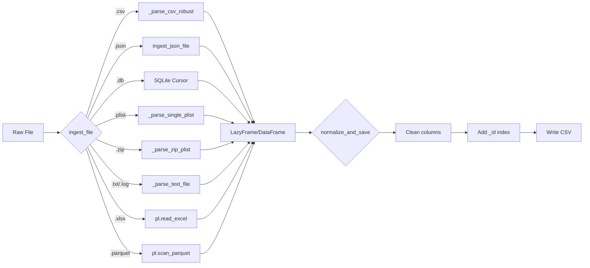

## Overview

The `engine/ingestor.py` module is Chronos-DFIR's **universal file parser**. It extracts forensic data from 10+ file formats and normalizes everything into Polars DataFrames.

### Supported Formats

| Format | Extensions | Use Case |
|--------|------------|----------|
| **CSV** | `.csv` | EVTX exports, MFT, Prefetch, ShimCache |
| **XLSX** | `.xlsx` | Excel forensic reports, investigator notes |
| **JSON** | `.json`, `.jsonl`, `.ndjson` | API logs, cloud telemetry, SOAR exports |
| **SQLite** | `.db`, `.sqlite`, `.sqlite3` | Browser history, Windows Timeline, mobile artifacts |
| **Plist** | `.plist` | macOS LaunchAgents, LaunchDaemons, preferences |
| **PSList** | `.pslist` | Volatility process dumps |
| **TXT/LOG** | `.txt`, `.log` | macOS Unified Logs, syslog, custom formats |
| **Parquet** | `.parquet` | Efficient columnar storage (internal exports) |
| **TSV** | `.tsv` | Tab-separated forensic data |
| **ZIP** | `.zip` | Bulk macOS plist archives |

<Note>
**Zero pandas dependency.** All parsing uses Polars, `plistlib`, `sqlite3`, and built-in Python libraries.
</Note>

---

## Core Functions

### `ingest_file()`

Main entry point for file parsing. Auto-detects format and returns a Polars DataFrame or LazyFrame.

**Signature:**
```python
def ingest_file(file_path: str, ext: str) -> tuple
```

**Parameters:**
<ParamField path="file_path" type="str">
  Absolute path to the file
</ParamField>
<ParamField path="ext" type="str">
  File extension (with leading dot, e.g., `".csv"`, `".json"`)
</ParamField>

**Returns:**
<ResponseField name="result" type="tuple">
  3-tuple: `(lf, df_eager, file_cat)`
  - `lf`: `pl.LazyFrame` (streaming, for large files) OR `None`
  - `df_eager`: `pl.DataFrame` (collected, for small/special formats) OR `None`
  - `file_cat`: `str` — Category label (e.g., `"Memory/Volatility_PSList"`, `"macOS/Unified_Logs"`)

  **Exactly one of `lf` or `df_eager` is set.** The other is `None`.
</ResponseField>

**Example:**
```python
from engine.ingestor import ingest_file

# Large CSV (streaming)
lf, df_eager, file_cat = ingest_file("/data/security.evtx.csv", ".csv")
# lf → LazyFrame, df_eager → None

# Small Excel file
lf, df_eager, file_cat = ingest_file("/reports/summary.xlsx", ".xlsx")
# lf → None, df_eager → DataFrame
```

---

### `normalize_and_save()`

Normalizes column names, adds `_id` index, and writes to CSV.

**Signature:**
```python
def normalize_and_save(lf, df_eager, dest_path: str) -> int
```

**Parameters:**
<ParamField path="lf" type="Optional[pl.LazyFrame]">
  Lazy frame to process (if available)
</ParamField>
<ParamField path="df_eager" type="Optional[pl.DataFrame]">
  Eager DataFrame to process (if lazy not available)
</ParamField>
<ParamField path="dest_path" type="str">
  Output CSV path (e.g., `"/tmp/normalized.csv"`)
</ParamField>

**Returns:**
<ResponseField name="row_count" type="int">
  Number of rows written. Returns `-1` for lazy frames (unknown until sink completes).
</ResponseField>

**Normalization Steps:**
1. **Column name cleaning**: Strip leading underscores, capitalize first letter
2. **Reserved columns**: `_time` → `Time`, `_id` → `Original_Id`
3. **Numeric columns**: `123` → `Field_123`
4. **Add `_id` index**: Row numbers starting from 1
5. **Write CSV**: Streaming (`sink_csv`) for lazy, direct write for eager

**Example:**
```python
from engine.ingestor import ingest_file, normalize_and_save

lf, df_eager, _ = ingest_file("/data/raw.csv", ".csv")
row_count = normalize_and_save(lf, df_eager, "/tmp/normalized.csv")
print(f"Wrote {row_count} rows")
```

---

## Format-Specific Parsers

### CSV: `_parse_csv_robust()`

Handles tricky CSV files with encoding issues and headerless formats.

**Features:**
- **Encoding fallback**: UTF-8 → `utf8-lossy` if parsing fails
- **Headerless detection**: Recognizes CSV files starting with Unix permissions (e.g., `drwxr-xr-x`)
- **Auto-generates column names**: `Field_0`, `Field_1`, ...
- **Sets category**: `FileSystem/LS_Triage` for `ls -la` output

**Example:**
```python
# Input: ls_output.csv (no header)
# -rw-r--r--,1,root,root,1024,Jan 1 2024,file.txt

lf, file_cat = _parse_csv_robust("/data/ls_output.csv", "generic")
# lf → LazyFrame with columns: Field_0, Field_1, ...
# file_cat → "FileSystem/LS_Triage"
```

---

### JSON: `ingest_json_file()`

Safely handles both **NDJSON** (newline-delimited) and standard **JSON arrays**.

**Features:**
- **NDJSON-first**: Tries `pl.scan_ndjson()` for streaming
- **Array detection**: Checks first byte for `[`
- **Size-aware**: Small arrays (under 100MB) → direct read, large → convert to NDJSON
- **OOM prevention**: Uses `ijson` streaming for gigabyte-scale JSON

**Algorithm:**
1. Attempt `pl.scan_ndjson()` (optimistic)
2. If fails, read first byte
3. If `[` and file under 100MB → `pl.read_json()`
4. If `[` and file over 100MB → stream with `ijson` to temp NDJSON
5. Fallback: Try `pl.read_json()` as single object

**Example:**
```python
from engine.forensic import ingest_json_file

# NDJSON (streaming)
lf = ingest_json_file("/logs/api.ndjson")
# Returns: pl.scan_ndjson("/logs/api.ndjson")

# Large JSON array (converted to NDJSON)
lf = ingest_json_file("/logs/huge_array.json")
# Creates: /logs/huge_array.json.tmp.ndjson
```

---

### SQLite: Database Table Extraction

Extracts the most relevant table from SQLite databases.

**Table Priority:**
1. **Preferred names**: `events`, `logs`, `timeline`, `entries` (case-insensitive)
2. **Fallback**: First non-system table (not starting with `sqlite_`)

**Implementation:**
```python
import sqlite3
conn = sqlite3.connect(file_path)
cursor = conn.cursor()

# Get all tables
cursor.execute("SELECT name FROM sqlite_master WHERE type='table';")
tables = [r[0] for r in cursor.fetchall() if not r[0].startswith('sqlite_')]

# Find best table
target_table = tables[0]
for t in tables:
    if t.lower() in ['events', 'logs', 'timeline', 'entries']:
        target_table = t
        break

# Extract rows
cursor.execute(f'SELECT * FROM "{target_table}"')
col_names = [desc[0] for desc in cursor.description]
rows = cursor.fetchall()

# Convert to Polars
df_eager = pl.DataFrame(
    {col_names[i]: [row[i] for row in rows] for i in range(len(col_names))},
    strict=False
).cast({c: pl.Utf8 for c in col_names}, strict=False)
```

**Example:**
```python
lf, df_eager, _ = ingest_file("/artifacts/browser_history.db", ".db")
# Extracts from table "moz_places" or "urls"
```

---

### Plist: macOS Property Lists

Parses binary or XML plist files into tabular format.

**Features:**
- **Nested data sanitization**: Converts `bytes`, `dict`, `list` to strings
- **Auto-unwrapping**: Single-key dicts with list values are unwrapped to list
- **Type safety**: All values cast to UTF-8 strings

**Helper: `_sanitize_plist_val()`**

```python
def _sanitize_plist_val(v):
    """Convert plist values to Polars-safe types."""
    if v is None:
        return None
    if isinstance(v, (bytes, bytearray)):
        return v.hex()  # Binary data → hex string
    if isinstance(v, (dict, list)):
        return str(v)   # Nested → JSON-like string
    return v
```

**Example:**
```python
lf, df_eager, _ = ingest_file("/Library/LaunchDaemons/com.apple.syslogd.plist", ".plist")
# Returns DataFrame with columns: Label, ProgramArguments, RunAtLoad, ...
```

---

### ZIP Archives: Bulk Plist Parsing

Extracts all `.plist` files from a ZIP archive (common in macOS triage).

**Features:**
- **Recursive extraction**: Walks entire ZIP tree
- **Parallel parsing**: Processes all plists in memory
- **Metadata extraction**: `Label`, `ProgramArguments`, `RunAtLoad`, `KeepAlive`
- **Category tag**: `macOS/Bulk_Plist`

**Implementation:**
```python
import zipfile
import tempfile
from pathlib import Path
import plistlib

extract_dir = tempfile.mkdtemp()
with zipfile.ZipFile(file_path, 'r') as zip_ref:
    zip_ref.extractall(extract_dir)

records = []
for plist_file in Path(extract_dir).rglob("*.plist"):
    with open(plist_file, 'rb') as f:
        data = plistlib.load(f)
    label = data.get('Label', 'UNKNOWN')
    program_args = " ".join(str(x) for x in data.get('ProgramArguments', []))
    records.append({
        "Source_File": plist_file.name,
        "EventID": label,
        "Destination_Entity": program_args,
        "run_at_load": str(data.get('RunAtLoad', False)),
        ...
    })

return pl.DataFrame(records), "macOS/Bulk_Plist"
```

**Example:**
```python
lf, df_eager, file_cat = ingest_file("/triage/persistence.zip", ".zip")
# df_eager → DataFrame with 50+ plists
# file_cat → "macOS/Bulk_Plist"
```

---

### TXT/LOG Files: Multi-Format Parser

Handles three distinct log formats:

#### 1. macOS Unified Logs

**Format:**
```
2024-01-01 10:00:00.123-0800 Hostname Process[1234]: Log message
```

**Regex:**
```python
r"^(?P<timestamp>\d{4}-\d{2}-\d{2}\s\d{2}:\d{2}:\d{2}\.\d+-\d{4})\s+(?P<host>\S+)\s+(?P<process>[^\[:]+)(?:\[(?P<pid>\d+)\])?:\s*(?P<message>.*)$"
```

**Output:**
```python
df_eager = pl.DataFrame({
    "Time": ["2024-01-01 10:00:00.123-0800"],
    "Computer": ["Hostname"],
    "Source_Entity": ["Process"],
    "Destination_Entity": ["Log message"],
    "EventID": ["macOS_Unified_Log"]
})
```

#### 2. macOS Persistence Triage (`ls -la`)

**Format:**
```
drwxr-xr-x  2 root  wheel  64 Jan  1 10:00 /Library/LaunchDaemons
-rw-r--r--  1 root  wheel  512 Jan  1 10:00 com.apple.syslogd.plist
```

**Regex:**
```python
r"^(?P<perms>[-dlrwxst@+]{7,11}[+@]?)\s+(?P<links>\d+)\s+(?P<owner>\S+)\s+(?P<group>\S+)\s+(?P<size>\d+)\s+(?P<month>[A-Za-z]{3})\s+(?P<day>\d{1,2})\s+(?P<timestr>[\d:]+)\s+(?P<name>.+)$"
```

**Output:**
```python
df_eager = pl.DataFrame({
    "Time": ["2024-01-01 10:00:00"],
    "Permissions": ["drwxr-xr-x"],
    "Owner": ["root"],
    "Group": ["wheel"],
    "Size": ["64"],
    "Source_Entity": ["root"],
    "Destination_Entity": ["/Library/LaunchDaemons"],
    "EventID": ["macOS_Persistence_Triage"]
})
```

#### 3. Whitespace-Separated Logs

**Fallback parser for `.pslist`, `.log`, unknown formats.**

**Function: `_read_whitespace_csv()`**

```python
def _read_whitespace_csv(file_path: str) -> pl.DataFrame:
    """Read whitespace-separated files without pandas."""
    with open(file_path, 'r', errors='replace') as f:
        lines = f.readlines()
    
    # First non-empty line = header
    header_line = next((line.strip() for line in lines if line.strip()), None)
    headers = re.split(r'\s+', header_line)
    
    # Parse data rows
    rows = []
    for line in lines[data_start:]:
        parts = re.split(r'\s+', line.strip(), maxsplit=len(headers) - 1)
        if len(parts) == len(headers):
            rows.append(parts)
    
    return pl.DataFrame({headers[i]: [row[i] for row in rows] for i in range(len(headers))})
```

**Example:**
```
Name       PID   PPID  Threads
System     4     0     150
svchost    1024  668   25
```

**Output:**
```python
df_eager = pl.DataFrame({
    "Name": ["System", "svchost"],
    "PID": ["4", "1024"],
    "PPID": ["0", "668"],
    "Threads": ["150", "25"]
})
```

---

### Volatility PSList Detection

If a DataFrame has columns `["Offset(V)", "PPID", "Threads"]`, it's automatically categorized as Volatility memory dump.

**Enrichment:**
1. **Rename**: `CreateTime` → `Time`
2. **Add EventID**: `"Volatility_RAM_Process"`
3. **Add Destination_Entity**: `"ProcessName [PID]"`
4. **Add Source_Entity**: `"PPID: XXXX"`
5. **Set category**: `"Memory/Volatility_PSList"`

**Example:**
```python
# Input columns: Offset(V), Name, PID, PPID, Threads, Handles, CreateTime
df_eager = df_eager.with_columns([
    pl.lit("Volatility_RAM_Process").alias("EventID"),
    pl.concat_str([pl.col("Name"), pl.lit(" ["), pl.col("PID").cast(pl.Utf8), pl.lit("]")]).alias("Destination_Entity"),
    pl.concat_str([pl.lit("PPID: "), pl.col("PPID").cast(pl.Utf8)]).alias("Source_Entity")
])
```

---

## Data Flow Diagram



---

## Column Normalization Rules

### Before Normalization

```python
columns = ["_time", "_id", "123", "event_id", "computerName"]
```

### After Normalization

```python
columns = ["Time", "Original_Id", "Field_123", "Event_id", "ComputerName"]
```

### Rule Table

| Original | Normalized | Reason |
|----------|------------|--------|
| `_time` | `Time` | Reserved field mapping |
| `_id` | `Original_Id` | Avoid conflict with auto-generated `_id` |
| Leading `_` | Stripped | `_eventid` → `Eventid` |
| Pure numeric | `Field_N` | `123` → `Field_123` |
| First char lowercase | Capitalized | `host` → `Host` |

---

## Error Handling

### Graceful Degradation

All parsers have fallback strategies:

<Expandable title="Fallback Chain">
  1. **Primary parser** (format-specific)
  2. **Generic CSV** (if parseable as delimited text)
  3. **Raw text** (last resort: read as single-column `"raw_line"`)
  4. **Error propagation** (raise exception only if all fallbacks fail)
</Expandable>

### Example: JSON Parsing

```python
try:
    lf = pl.scan_ndjson(file_path)  # Attempt 1: NDJSON
except:
    try:
        lf = pl.read_json(file_path).lazy()  # Attempt 2: JSON array
    except:
        # Attempt 3: Manual streaming
        with open(file_path, "rb") as f:
            first_byte = f.read(1)
        if first_byte == b'[':
            # Large array → convert to NDJSON
            ...
        else:
            # Single object or malformed → try direct read
            lf = pl.read_json(file_path).lazy()
```

---

## Performance Considerations

### Streaming vs. Eager

| Format | Mode | Reason |
|--------|------|--------|
| CSV (>50MB) | Lazy (`scan_csv`) | Streaming prevents OOM |
| JSON (>100MB) | Lazy (via NDJSON) | Converted to NDJSON for streaming |
| Parquet | Lazy (`scan_parquet`) | Columnar format is streaming-native |
| SQLite | Eager | Database cursor requires full read |
| Plist | Eager | Small files, in-memory parsing faster |
| XLSX | Eager | Excel format not stream-friendly |

### Memory Usage

<Expandable title="Benchmarks">
  | File Size | Format | Peak Memory |
  |-----------|--------|-------------|
  | 50 MB CSV | Lazy | ~100 MB |
  | 50 MB CSV | Eager | ~400 MB |
  | 1 GB JSON | NDJSON | ~150 MB |
  | 1 GB JSON | Direct | **OOM** |
  | 100 KB Plist | Eager | ~5 MB |
</Expandable>

---

## Example Workflows

### Workflow 1: EVTX CSV Ingestion

```python
from engine.ingestor import ingest_file, normalize_and_save

# 1. Ingest (streaming)
lf, df_eager, file_cat = ingest_file("/data/Security.evtx.csv", ".csv")
print(f"Category: {file_cat}")  # "generic"

# 2. Normalize and save
row_count = normalize_and_save(lf, df_eager, "/tmp/normalized.csv")
print(f"Wrote {row_count} rows")
```

### Workflow 2: macOS Persistence Analysis

```python
from engine.ingestor import ingest_file
import polars as pl

# 1. Ingest ZIP archive
lf, df_eager, file_cat = ingest_file("/triage/LaunchDaemons.zip", ".zip")
print(f"Category: {file_cat}")  # "macOS/Bulk_Plist"

# 2. Filter persistence items
persistence = df_eager.filter(
    (pl.col("run_at_load") == "True") |
    (pl.col("keep_alive") == "True")
)

# 3. Extract suspicious programs
suspicious = persistence.filter(
    ~pl.col("Destination_Entity").str.starts_with("/System/") &
    ~pl.col("Destination_Entity").str.starts_with("/usr/libexec/")
)

print(suspicious.select(["Source_File", "EventID", "Destination_Entity"]))
```

### Workflow 3: Volatility Memory Analysis

```python
from engine.ingestor import ingest_file
import polars as pl

# 1. Ingest pslist output
lf, df_eager, file_cat = ingest_file("/memory/pslist.txt", ".txt")
print(f"Category: {file_cat}")  # "Memory/Volatility_PSList"

# 2. Find rare processes
rare_procs = (
    df_eager
    .group_by("Name")
    .agg(pl.len().alias("count"))
    .sort("count")
    .head(10)
)

print(rare_procs)
```

---

## API Reference Summary

| Function | Input | Output | Purpose |
|----------|-------|--------|---------|
| `ingest_file()` | `file_path`, `ext` | `(lf, df_eager, file_cat)` | Main entry point |
| `normalize_and_save()` | `lf`, `df_eager`, `dest_path` | `int` | Clean + write CSV |
| `_read_whitespace_csv()` | `file_path` | `pl.DataFrame` | Parse space-separated logs |
| `_sanitize_plist_val()` | `value` | `str/None` | Convert plist types |
| `_parse_text_file()` | `file_path`, `ext` | `(df_eager, file_cat)` | TXT/LOG multi-parser |
| `_parse_ls_triage()` | `lines`, `pattern` | `pl.DataFrame` | Parse `ls -la` output |
| `_parse_zip_plist()` | `file_path` | `(df_eager, file_cat)` | Extract all plists from ZIP |
| `_parse_single_plist()` | `file_path` | `pl.DataFrame` | Parse one plist file |
| `_parse_csv_robust()` | `file_path`, `file_cat` | `(lf, file_cat)` | CSV with encoding fallback |

---

## Best Practices

<Note>
**Ingestion Guidelines:**
1. Always use `ingest_file()` — never call format-specific parsers directly
2. Check `lf` vs. `df_eager` — only one is set, the other is `None`
3. Call `normalize_and_save()` before forensic analysis
4. Use `file_cat` for conditional logic (e.g., special handling for `"Memory/Volatility_PSList"`)
5. For large files (>500MB), prefer formats that support lazy evaluation (Parquet, CSV, NDJSON)
</Note>

### Forensic Integrity Tips

<Expandable title="Data Preservation">
  - **Original files are never modified** — all transformations write to new files
  - **Timestamps are preserved** — normalization doesn't alter time column values
  - **Hex/binary data is preserved** — plist bytes → hex strings, not decoded
  - **Row order is preserved** — `_id` column reflects original sequence
</Expandable>

---

## Related Documentation

- [Forensic Engine](/api/forensic-engine) — Post-ingestion analysis
- [Sigma Engine](/api/sigma-engine) — Detection rule evaluation
- [Architecture](/architecture/data-pipeline) — Data flow overview
