## Overview

Chronos-DFIR provides **deep MITRE ATT&CK framework integration** to automatically map forensic evidence to adversary Tactics, Techniques, and Procedures (TTPs). Every Sigma detection rule and YARA signature includes MITRE technique tags, enabling analysts to visualize the **attack kill chain** and prioritize investigation based on threat actor behavior.

<Info>
**MITRE ATT&CK** is a globally accessible knowledge base of adversary tactics and techniques based on real-world observations. Chronos-DFIR uses ATT&CK v14 (2024) with 14 tactics and 200+ techniques.
</Info>

---

## Framework Coverage

Chronos-DFIR detection rules cover **all 12 enterprise tactics** + **Impact (TA0040)**:

<AccordionGroup>
  <Accordion title="TA0001 - Initial Access" icon="door-open">
    **Goal**: How adversaries gain initial foothold

    **Techniques Covered**:
    - **T1078** - Valid Accounts (compromised credentials)
    - **T1190** - Exploit Public-Facing Application
    - **T1566** - Phishing (spearphishing attachments/links)
    - **T1133** - External Remote Services (VPN, RDP brute force)

    **Detection Examples**:
    - Anomalous logon patterns (service account interactive logons)
    - Off-hours authentication from unusual IPs
    - Exploit artifact traces in IIS/Apache logs
  </Accordion>

  <Accordion title="TA0002 - Execution" icon="play">
    **Goal**: Running malicious code on victim system

    **Techniques Covered**:
    - **T1059.001** - PowerShell (encoded commands)
    - **T1059.003** - Windows Command Shell
    - **T1059.004** - Unix Shell (bash, sh)
    - **T1047** - WMI Execution
    - **T1204** - User Execution (malicious documents)

    **Detection Examples**:
    - `powershell.exe -EncodedCommand` with hidden window style
    - WMI process creation via `wmic process call create`
    - Suspicious script execution from temp directories
  </Accordion>

  <Accordion title="TA0003 - Persistence" icon="clock">
    **Goal**: Maintaining access across reboots

    **Techniques Covered**:
    - **T1547.001** - Registry Run Keys
    - **T1053.005** - Scheduled Task/Job
    - **T1543.003** - Windows Service Creation
    - **T1574.001** - DLL Search Order Hijacking
    - **T1176** - Browser Extensions
    - **T1037** - Boot/Logon Initialization Scripts

    **Detection Examples**:
    - New scheduled tasks with suspicious paths
    - Service creation from non-standard directories
    - LaunchAgent/LaunchDaemon persistence (macOS)
  </Accordion>

  <Accordion title="TA0004 - Privilege Escalation" icon="arrow-up">
    **Goal**: Gaining higher-level permissions

    **Techniques Covered**:
    - **T1548.002** - Bypass User Account Control (UAC)
    - **T1068** - Exploitation for Privilege Escalation
    - **T1134** - Access Token Manipulation
    - **T1078** - Valid Accounts (privilege escalation)

    **Detection Examples**:
    - UAC bypass via CMSTP, FodHelper, EventVwr hijacking
    - Token impersonation events (Event ID 4672)
    - Exploitation of unpatched CVEs
  </Accordion>

  <Accordion title="TA0005 - Defense Evasion" icon="shield-slash">
    **Goal**: Avoiding detection by security tools

    **Techniques Covered**:
    - **T1070.001** - Clear Windows Event Logs
    - **T1070.003** - Clear Command History
    - **T1562.001** - Disable/Modify Tools (AV, EDR, Firewall)
    - **T1027** - Obfuscated Files or Information
    - **T1218** - System Binary Proxy Execution (rundll32, regsvr32)
    - **T1112** - Modify Registry

    **Detection Examples**:
    - `wevtutil cl Security` (log clearing)
    - Windows Defender disabled via registry modification
    - LOLBin abuse: `rundll32.exe` loading suspicious DLLs
  </Accordion>

  <Accordion title="TA0006 - Credential Access" icon="key">
    **Goal**: Stealing credentials and secrets

    **Techniques Covered**:
    - **T1003.001** - LSASS Memory Dumping (Mimikatz)
    - **T1003.002** - Security Account Manager (SAM) extraction
    - **T1552.001** - Credentials in Files
    - **T1555** - Credentials from Password Stores
    - **T1110** - Brute Force

    **Detection Examples**:
    - Process access to `lsass.exe` with `PROCESS_VM_READ`
    - SAM/SYSTEM registry hive export
    - Browser credential database access (Login Data, logins.json)
  </Accordion>

  <Accordion title="TA0007 - Discovery" icon="magnifying-glass">
    **Goal**: Learning about victim environment

    **Techniques Covered**:
    - **T1087** - Account Discovery
    - **T1083** - File and Directory Discovery
    - **T1057** - Process Discovery
    - **T1049** - System Network Connections Discovery
    - **T1018** - Remote System Discovery

    **Detection Examples**:
    - `net user /domain` (domain account enumeration)
    - `dir C:\Users\*\Documents` (document reconnaissance)
    - `tasklist`, `ps aux`, `netstat -ano` (environment mapping)
  </Accordion>

  <Accordion title="TA0008 - Lateral Movement" icon="arrows-left-right">
    **Goal**: Moving through victim network

    **Techniques Covered**:
    - **T1021.001** - Remote Desktop Protocol (RDP)
    - **T1021.002** - SMB/Windows Admin Shares
    - **T1047** - Windows Management Instrumentation
    - **T1076** - Remote Desktop Protocol (legacy)

    **Detection Examples**:
    - Network logon Type 3 from admin accounts
    - PsExec execution artifacts (Event ID 7045)
    - RDP logon Type 10 to multiple systems rapidly
  </Accordion>

  <Accordion title="TA0009 - Collection" icon="database">
    **Goal**: Gathering data of interest

    **Techniques Covered**:
    - **T1560** - Archive Collected Data (7zip, WinRAR, tar)
    - **T1074** - Data Staged (local/remote staging)
    - **T1113** - Screen Capture
    - **T1005** - Data from Local System

    **Detection Examples**:
    - 7z.exe compressing sensitive directories
    - Large files staged in `C:\ProgramData\` or `C:\Temp\`
    - Screenshot tools (snipping tool, malicious screen capture)
  </Accordion>

  <Accordion title="TA0010 - Exfiltration" icon="cloud-arrow-up">
    **Goal**: Stealing data from victim network

    **Techniques Covered**:
    - **T1048** - Exfiltration Over Alternative Protocol (DNS, ICMP)
    - **T1567.002** - Exfiltration to Cloud Storage (Mega, Dropbox, S3)
    - **T1041** - Exfiltration Over C2 Channel
    - **T1537** - Transfer Data to Cloud Account (rclone)

    **Detection Examples**:
    - Rclone syncing to external cloud storage
    - Unusual DNS query volumes (DNS tunneling)
    - Large outbound transfers to non-corporate IPs
  </Accordion>

  <Accordion title="TA0011 - Command and Control" icon="satellite-dish">
    **Goal**: Communicating with compromised systems

    **Techniques Covered**:
    - **T1071.001** - Web Protocols (HTTP/HTTPS C2)
    - **T1071.004** - DNS (DNS tunneling)
    - **T1573** - Encrypted Channel
    - **T1090** - Proxy (SOCKS, web proxies)

    **Detection Examples**:
    - Cobalt Strike beacon traffic patterns
    - DNS queries to `.onion` domains (Tor C2)
    - Suspicious SSL certificates (self-signed, invalid CN)
  </Accordion>

  <Accordion title="TA0040 - Impact" icon="bomb">
    **Goal**: Disrupting business operations

    **Techniques Covered**:
    - **T1486** - Data Encrypted for Impact (ransomware)
    - **T1490** - Inhibit System Recovery (shadow copy deletion)
    - **T1489** - Service Stop (disabling backups)
    - **T1491** - Defacement

    **Detection Examples**:
    - `vssadmin delete shadows /all /quiet`
    - Ransomware encryption patterns (file extension changes)
    - Service termination (SQL, Exchange, backup agents)
  </Accordion>
</AccordionGroup>

---

## TTP Extraction and Display

### How TTPs Are Extracted

Chronos-DFIR parses MITRE technique IDs from Sigma rule tags:

```python
# In engine/sigma_engine.py
raw_tags = rule.get("tags", []) or []
tags = []
for t in raw_tags:
    t_lower = str(t).lower().strip()
    # Normalize "mitre.tXXXX" → "attack.tXXXX"
    if t_lower.startswith("mitre.t"):
        t_lower = "attack." + t_lower[6:]
    tags.append(t_lower)

# Extract technique and tactic from custom field
mitre_technique = custom.get("mitre_technique", 
    next((t for t in tags if t.startswith("attack.t")), "")
)
mitre_tactic = custom.get("mitre_tactic",
    next((t for t in tags if t.startswith("attack.") and not t.startswith("attack.t")), "")
)
```

**Example Sigma Rule with MITRE Tags**:

```yaml
title: PowerShell Encoded Command
tags:
  - attack.execution
  - attack.t1059.001
  - attack.defense_evasion
  - attack.t1027
custom:
  mitre_tactic: "TA0002 – Execution"
  mitre_technique: "T1059.001 – PowerShell"
```

### Dashboard TTP Summary Strip

The **TTP Summary Strip** displays active techniques at the top of the dashboard:

```html
<div id="ttp-summary-strip">
  <div class="ttp-severity">
    <span class="ttp-badge ttp-critical">CRITICAL: 3</span>
    <span class="ttp-badge ttp-high">HIGH: 12</span>
    <span class="ttp-badge ttp-medium">MEDIUM: 8</span>
  </div>
  <div class="ttp-techniques">
    <span class="ttp-tech">T1003</span>
    <span class="ttp-tech">T1059</span>
    <span class="ttp-tech">T1070</span>
    <span class="ttp-tech">T1218</span>
    <span class="ttp-tech">T1486</span>
    <span class="ttp-tech">T1490</span>
  </div>
</div>
```

**JavaScript Update Logic**:

```javascript
// In static/js/main.js
function updateTTPStrip(forensicData) {
    const sigmaHits = forensicData.sigma_detections || [];
    
    // Extract severity counts
    const severityCounts = {
        critical: sigmaHits.filter(h => h.level === 'critical').length,
        high: sigmaHits.filter(h => h.level === 'high').length,
        medium: sigmaHits.filter(h => h.level === 'medium').length
    };
    
    // Extract unique techniques
    const techniques = [...new Set(
        sigmaHits
            .flatMap(h => h.tags.filter(t => t.startsWith('attack.t')))
            .map(t => t.replace('attack.', '').toUpperCase())
    )].slice(0, 6);  // Top 6
    
    // Render badges and pills
    document.getElementById('ttp-summary-strip').innerHTML = `...`;
}
```

### Forensic Context Modal - MITRE Kill Chain

The **Forensic Context modal** includes a dedicated MITRE kill chain section:

```html
<div class="mitre-kill-chain">
  <h4>🎯 MITRE ATT&CK Kill Chain</h4>
  <div class="tactic-row">
    <div class="tactic-badge tactic-initial-access">
      <strong>Initial Access</strong> (TA0001)
      <ul>
        <li>T1078 - Valid Accounts (18 events)</li>
        <li>T1190 - Exploit Public-Facing App (3 events)</li>
      </ul>
    </div>
    <div class="tactic-badge tactic-execution">
      <strong>Execution</strong> (TA0002)
      <ul>
        <li>T1059.001 - PowerShell (42 events)</li>
        <li>T1047 - WMI Execution (7 events)</li>
      </ul>
    </div>
    <!-- ... more tactics ... -->
  </div>
</div>
```

---

## Kill Chain Visualization

Chronos-DFIR organizes detected techniques into a **linear kill chain** that mirrors the adversary's progression through the MITRE framework:

```mermaid
graph LR
    A[TA0001<br/>Initial Access<br/>T1078] --> B[TA0002<br/>Execution<br/>T1059.001]
    B --> C[TA0003<br/>Persistence<br/>T1053.005]
    C --> D[TA0004<br/>Privilege Escalation<br/>T1548.002]
    D --> E[TA0005<br/>Defense Evasion<br/>T1070.001]
    E --> F[TA0006<br/>Credential Access<br/>T1003.001]
    F --> G[TA0007<br/>Discovery<br/>T1083]
    G --> H[TA0008<br/>Lateral Movement<br/>T1021.002]
    H --> I[TA0009<br/>Collection<br/>T1560]
    I --> J[TA0010<br/>Exfiltration<br/>T1048]
    J --> K[TA0040<br/>Impact<br/>T1486]
```



<Note>
**Kill Chain Logic**: Tactics are ordered chronologically to show attack progression. Not all incidents will trigger every tactic—ransomware may skip lateral movement and jump directly from Execution → Impact.
</Note>

---

## TTP Analysis in README Context

The README.md from the source repository provides insight into how TTP analysis is performed:

### Forensic Report TTP Extraction

From `README.md` (lines 232-250):

> **TTP Summary Strip**
> - Nuevo elemento `#ttp-summary-strip` debajo del dashboard con badges de severity (CRITICAL: N, HIGH: N) + pills de MITRE techniques (T1003, T1059, etc.)
> - Se actualiza dinámicamente con cada refresh del dashboard (filtros, time range)
> - Proporciona feedback visual inmediato de que los TTPs cambiaron al filtrar

### MITRE Integration Architecture

```python
# In engine/forensic.py
def sub_extract_tactics_from_sigma(sigma_hits: list) -> dict:
    """
    Parse Sigma hits and group by MITRE tactic.
    Returns: {tactic: [techniques]}
    """
    tactics = {}
    for hit in sigma_hits:
        tactic = hit.get('mitre_tactic', 'Unknown')
        technique = hit.get('mitre_technique', 'Unknown')
        if tactic not in tactics:
            tactics[tactic] = []
        tactics[tactic].append({
            'id': technique,
            'title': hit['title'],
            'level': hit['level'],
            'matched_rows': hit['matched_rows']
        })
    return tactics
```

---

## Export Formats with TTP Data

### Context Export (JSON)

When exporting forensic context, TTP data is included:

```json
{
  "artifact_name": "SecurityLogs.evtx",
  "risk_level": "Critical",
  "mitre_kill_chain": {
    "TA0001 - Initial Access": [
      {
        "technique": "T1078",
        "name": "Valid Accounts",
        "evidence_count": 18,
        "severity": "high"
      }
    ],
    "TA0002 - Execution": [
      {
        "technique": "T1059.001",
        "name": "PowerShell",
        "evidence_count": 42,
        "severity": "high"
      }
    ]
  },
  "sigma_detections": [
    {
      "title": "PowerShell Encoded Command",
      "level": "high",
      "mitre_technique": "T1059.001",
      "mitre_tactic": "TA0002",
      "matched_rows": 42,
      "sample_evidence": [...]
    }
  ]
}
```

### HTML Report

The HTML export includes a color-coded kill chain section:

```html
<div class="mitre-section">
  <h3>MITRE ATT&CK Coverage</h3>
  <table class="mitre-table">
    <tr>
      <th>Tactic</th>
      <th>Techniques</th>
      <th>Evidence Count</th>
    </tr>
    <tr>
      <td class="tactic-initial-access">TA0001 - Initial Access</td>
      <td>T1078 (Valid Accounts)</td>
      <td>18 events</td>
    </tr>
    <tr>
      <td class="tactic-execution">TA0002 - Execution</td>
      <td>T1059.001 (PowerShell), T1047 (WMI)</td>
      <td>49 events</td>
    </tr>
  </table>
</div>
```

---

## MITRE ATT&CK Tactic Reference

| Code | Tactic | Description | Common Techniques |
|------|--------|-------------|-------------------|
| **TA0001** | Initial Access | Entry point into network | T1078, T1190, T1566 |
| **TA0002** | Execution | Running malicious code | T1059, T1047, T1204 |
| **TA0003** | Persistence | Maintaining access | T1547, T1053, T1543 |
| **TA0004** | Privilege Escalation | Gaining higher permissions | T1548, T1068, T1134 |
| **TA0005** | Defense Evasion | Avoiding detection | T1070, T1562, T1027 |
| **TA0006** | Credential Access | Stealing credentials | T1003, T1552, T1555 |
| **TA0007** | Discovery | Learning environment | T1087, T1083, T1057 |
| **TA0008** | Lateral Movement | Moving through network | T1021, T1047, T1076 |
| **TA0009** | Collection | Gathering target data | T1560, T1074, T1113 |
| **TA0010** | Exfiltration | Stealing data | T1048, T1567, T1041 |
| **TA0011** | Command & Control | Communicating with victim | T1071, T1573, T1090 |
| **TA0040** | Impact | Disrupting operations | T1486, T1490, T1489 |

---

## Real-World Example: Ransomware Attack

Here's how Chronos-DFIR maps a typical ransomware incident:

### Detection Timeline

1. **TA0001 - Initial Access**: Phishing email with malicious attachment
   - Sigma Rule: `T1566_Phishing.yml` (Office document with macros)

2. **TA0002 - Execution**: PowerShell downloads second-stage payload
   - Sigma Rule: `T1059_001_powershell_encoded.yml` (42 encoded commands)

3. **TA0005 - Defense Evasion**: Disables Windows Defender
   - Sigma Rule: `T1562_impair_defenses.yml` (registry modification)

4. **TA0007 - Discovery**: Enumerates domain accounts and shares
   - Sigma Rule: `T1087_account_discovery.yml` (`net user /domain`)

5. **TA0008 - Lateral Movement**: Spreads to file servers via SMB
   - Sigma Rule: `T1021_002_smb_admin_shares.yml` (admin$ access)

6. **TA0006 - Credential Access**: Dumps LSASS memory
   - Sigma Rule: `T1003_credential_dumping.yml` (Mimikatz detected)

7. **TA0009 - Collection**: Stages 15GB of data in C:\ProgramData\
   - Sigma Rule: `T1074_data_staged.yml` (large file staging)

8. **TA0010 - Exfiltration**: Uploads to Mega.nz via rclone
   - YARA Rule: `QILIN_Ransomware_Rclone_Exfiltration` (rclone strings)

9. **TA0040 - Impact**: Deletes shadow copies, encrypts files
   - Sigma Rule: `T1490_inhibit_system_recovery.yml` (vssadmin delete)
   - YARA Rule: `QILIN_Ransomware_Strings_Windows` (ransom note)

### Chronos-DFIR Output

**Dashboard Badge**: `CRITICAL: 3  HIGH: 9`

**TTP Strip**: `T1566  T1059  T1562  T1003  T1486  T1490`

**Risk Level**: **Critical** (95/100)

**Forensic Context Export**:
```json
{
  "kill_chain_summary": "Full ransomware kill chain detected: Initial Access → Execution → Lateral Movement → Credential Theft → Exfiltration → Impact",
  "ttps_detected": 9,
  "tactics_covered": ["TA0001", "TA0002", "TA0005", "TA0006", "TA0007", "TA0008", "TA0009", "TA0010", "TA0040"],
  "threat_actor_profile": "Ransomware operator with lateral movement and data exfiltration capabilities (double extortion)"
}
```

---

## Threat Actor Profiling

Chronos-DFIR uses TTP patterns to infer threat actor sophistication:

| TTP Pattern | Actor Profile | Example Groups |
|-------------|---------------|----------------|
| **Tactic count: 3-5** | Script kiddie, opportunistic malware | Commodity ransomware, cryptominers |
| **Tactic count: 6-8** | Organized cybercrime, ransomware operators | LockBit, BlackCat, ALPHV |
| **Tactic count: 9+** | APT, nation-state, advanced ransomware | APT29, APT41, Conti, QILIN |
| **TA0006 + TA0010** | Credential theft + exfiltration = double extortion | Modern ransomware groups (post-2020) |
| **TA0008 only** | Worm-like propagation | WannaCry, NotPetya |

---

## Related Detection Systems

<CardGroup cols={2}>
  <Card title="Sigma Rules" icon="shield-check" href="/detection/sigma-rules">
    86+ detection rules with MITRE technique tags
  </Card>
  <Card title="YARA Rules" icon="dna" href="/detection/yara-rules">
    Binary pattern matching with MITRE attribution
  </Card>
</CardGroup>

---

## External Resources

- [MITRE ATT&CK Framework](https://attack.mitre.org/)
- [ATT&CK Navigator](https://mitre-attack.github.io/attack-navigator/)
- [MITRE ATT&CK for ICS](https://attack.mitre.org/tactics/ics/)
- [CAR Analytics Repository](https://car.mitre.org/)

---

## Continuous Coverage Expansion

Chronos-DFIR's MITRE coverage grows with each detection rule added:

**Current Coverage (v185)**: 
- **86 Sigma rules** covering 51 techniques across 12 tactics
- **7 YARA rule sets** with technique attribution

**Roadmap**:
- **v2.0**: Expand to 150+ rules, add Mobile ATT&CK (Android/iOS)
- **v3.0**: ICS/OT ATT&CK for industrial control systems
- **v4.0**: Automated ATT&CK Navigator heatmap generation
