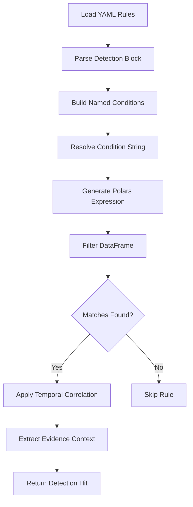

## Overview

Chronos-DFIR integrates a powerful **Sigma detection engine** that translates YAML-based Sigma rules into optimized Polars LazyFrame expressions for real-time threat detection during forensic analysis. The engine evaluates **86+ detection rules** against ingested evidence, automatically flagging suspicious activity aligned with the MITRE ATT&CK framework.

<Info>
**Sigma** is an open-source generic signature format for SIEM systems and log analysis tools. Chronos-DFIR implements a custom Sigma-to-Polars compiler that enables offline, vectorized detection without external dependencies.
</Info>

---

## Engine Architecture

The Sigma engine (`engine/sigma_engine.py`) is a **575-line dynamic YAML-to-Polars compiler** that provides:

### Core Capabilities (v1.2)

- **Field Modifiers**: `contains`, `endswith`, `startswith`, `any`, `all`, `not`, `re` (regex)
- **EventID Matching**: Intelligent `is_in` matching with case-insensitive column lookup
- **Boolean Logic**: AND/OR conditions between detection blocks with complex nesting
- **Temporal Correlation**: `timeframe` + `correlation` blocks (event_count, group-by, threshold)
- **Custom Aggregation**: Time window grouping with configurable thresholds
- **Evidence Extraction**: Returns `sample_evidence` (150 rows), `matched_columns`, `all_row_ids` (500 IDs)

### Field Resolution

The engine performs **case-insensitive column matching** with dot-notation fallback:

```python
# Handles both explicit columns and nested Windows EventData fields
"EventData.CommandLine" → tries "EventData.CommandLine" → falls back to "CommandLine"
"Image" → matches "Image", "image", or "IMAGE"
```

### Detection Workflow



---

## Rule Categories and Coverage

Chronos-DFIR includes **86 Sigma rules** organized into 5 categories:

<AccordionGroup>
  <Accordion title="MITRE ATT&CK Tactics (51 rules)" icon="crosshairs">
    Covers all 12 MITRE tactics with technique-specific detections:

    | Tactic | Code | Rules | Example Techniques |
    |--------|------|-------|--------------------|
    | Initial Access | TA0001 | 2 | T1078 (Valid Accounts), T1190 (Exploit Public-Facing App) |
    | Execution | TA0002 | 5 | T1059.001 (PowerShell), T1047 (WMI), T1204 (User Execution) |
    | Persistence | TA0003 | 7 | T1547 (Boot/Logon), T1053 (Scheduled Task), T1543 (Service Creation) |
    | Privilege Escalation | TA0004 | 4 | T1548.002 (Bypass UAC), T1068 (Exploit Vuln) |
    | Defense Evasion | TA0005 | 8 | T1070.003 (Clear Logs), T1562 (Impair Defenses), T1027 (Obfuscation) |
    | Credential Access | TA0006 | 4 | T1003 (Credential Dumping), T1552 (Unsecured Credentials) |
    | Discovery | TA0007 | 5 | T1057 (Process Discovery), T1083 (File/Directory Discovery) |
    | Lateral Movement | TA0008 | 3 | T1021.002 (SMB/Admin Shares), T1021.001 (RDP) |
    | Collection | TA0009 | 2 | T1560 (Archive via Utility), T1074 (Data Staged) |
    | Exfiltration | TA0010 | 3 | T1048 (Exfil via Alternative Protocol), T1567 (Cloud Storage) |
    | Command & Control | TA0011 | 4 | T1071 (Application Layer Protocol), T1572 (Protocol Tunneling) |
    | Impact | TA0040 | 4 | T1486 (Data Encrypted), T1490 (Inhibit System Recovery) |
  </Accordion>

  <Accordion title="Forensic Artifacts (12 rules)" icon="folder-open">
    Detection rules for Windows forensic artifact analysis:

    - **Prefetch**: Suspicious execution evidence in `C:\Windows\Prefetch\*.pf`
    - **ShimCache**: Application Compatibility Cache anomalies
    - **AmCache**: Unauthorized program installation indicators
    - **UserAssist**: GUID-encoded user activity forensics
    - **SRUM**: System Resource Usage Monitor abuse (network, CPU spikes)
    - **LNK/JumpLists**: Lateral movement via Jump List artifacts
    - **ShellBags**: Folder access patterns indicating reconnaissance
    - **MRU**: Most Recently Used registry keys with suspicious paths
    - **Recycle Bin**: Anti-forensics (file deletion before encryption)
  </Accordion>

  <Accordion title="Linux Detection (10 rules)" icon="terminal">
    Coverage for Linux/Unix forensic artifacts:

    - **Reverse Shells**: Bash/Python/Netcat C2 connections
    - **SSH Brute Force**: auth.log failed authentication analysis
    - **Sudo Abuse**: Privilege escalation via misconfigured sudoers
    - **Systemd Persistence**: Malicious `.service` files
    - **Cron Manipulation**: Backdoors via scheduled tasks
    - **Auditd Events**: Kernel-level security event anomalies
    - **Container Escape**: Docker/K8s breakout indicators
  </Accordion>

  <Accordion title="macOS Detection (5 rules)" icon="apple">
    macOS-specific threat hunting rules:

    - **TCC Bypass**: Transparency, Consent, Control database manipulation
    - **Gatekeeper Bypass**: Unsigned application execution
    - **XProtect Evasion**: Anti-malware bypass techniques
    - **Authorization Plugins**: Persistence via authorization database
    - **Unified Log Suspicious Shells**: macOS Unified Log shell execution
  </Accordion>

  <Accordion title="Browser Forensics (8 rules)" icon="globe">
    Web browser artifact analysis:

    - **History Manipulation**: Cleared or tampered browsing history
    - **Cookie Theft**: Session hijacking indicators
    - **Cache Forensics**: Unusual cached resources (malware downloads)
    - **Extension Abuse**: Malicious browser extensions
  </Accordion>
</AccordionGroup>

---

## Example Sigma Rules

### Rule 1: Anomalous Windows Logon Patterns (T1078)

```yaml
title: Anomalous Logon Patterns – Account Usage and Type Anomalies
id: d4e5f6a7-3434-4d8e-e9f0-a1b2c3d4e5f6
status: stable
description: |
  Detects anomalous Windows logon patterns beyond brute force.
  Covers logon type mismatches (service accounts logging interactively),
  impossible travel, off-hours auth, and cleartext logons.
tags:
  - attack.initial_access
  - attack.t1078
  - attack.lateral_movement
logsource:
  product: windows
  service: security
detection:
  service_account_interactive:
    EventID: '4624'
    LogonType:
      - '2'   # Interactive console
      - '10'  # RDP
    TargetUserName|contains|any:
      - 'svc_'
      - 'service'
      - 'sql'
  cleartext_logon:
    EventID: '4624'
    LogonType: '8'  # NetworkCleartext (unencrypted)
  condition: service_account_interactive or cleartext_logon
level: high
```

<Note>
**Detection Logic**: Service accounts should NEVER authenticate interactively (Type 2/10). LogonType 8 sends passwords in cleartext—both patterns indicate credential compromise.
</Note>

### Rule 2: PowerShell Encoded Command (T1059.001)

```yaml
title: Suspicious PowerShell Encoded Command Execution
id: b2c3d4e5-f6a7-8901-bcde-f12345678901
description: |
  Detects PowerShell with Base64-encoded commands—common
  attacker obfuscation technique.
tags:
  - attack.execution
  - attack.t1059.001
  - attack.defense_evasion
detection:
  powershell_process:
    Image|endswith:
      - '\powershell.exe'
      - '\pwsh.exe'
  encoded_param:
    CommandLine|contains|any:
      - ' -EncodedCommand '
      - ' -Enc '
      - ' -ec '
  condition: powershell_process and encoded_param
level: high
```

### Rule 3: Prefetch Execution Evidence

```yaml
title: Suspicious Prefetch Entries
description: |
  Detects execution of suspicious binaries via Windows Prefetch
  artifacts (C:\Windows\Prefetch\*.pf)
detection:
  suspicious_paths:
    PrefetchFile|contains|any:
      - '\Temp\'
      - '\AppData\Roaming\'
      - '\Downloads\'
      - '.tmp.exe'
      - 'C$\'
  rare_extensions:
    ExecutableName|endswith|any:
      - '.vbs'
      - '.js'
      - '.hta'
      - '.cmd'
  condition: suspicious_paths or rare_extensions
level: medium
```

---

## Rule Syntax and Structure

### YAML Schema

Every Sigma rule follows this structure:

```yaml
title: Human-readable detection name
id: UUID (unique identifier)
status: stable | experimental | deprecated
description: Multi-line explanation of what this rule detects
references:
  - https://attack.mitre.org/techniques/TXXXX/
author: Chronos-DFIR / Analyst Name
date: YYYY/MM/DD
tags:
  - attack.tactic_name
  - attack.tXXXX        # MITRE technique ID
logsource:
  category: process_creation | network_connection | file_event
  product: windows | linux | macos
  service: security | sysmon | auditd
detection:
  selection_1:
    FieldName: value
    FieldName|modifier: value
  selection_2:
    FieldName|contains|any:
      - string1
      - string2
  condition: selection_1 and not selection_2
falsepositives:
  - Known benign behavior causing false alerts
level: critical | high | medium | low
fields:
  - EventID
  - CommandLine
  - User
custom:
  mitre_tactic: "TA0002 – Execution"
  mitre_technique: "T1059 – Command and Scripting Interpreter"
```

### Supported Field Modifiers

| Modifier | Description | Example |
|----------|-------------|----------|
| `contains` | Substring match | `CommandLine|contains: 'mimikatz'` |
| `startswith` | Prefix match | `Image|startswith: 'C:\\Temp\\'` |
| `endswith` | Suffix match | `Image|endswith: '\\powershell.exe'` |
| `re` | Regex pattern | `CommandLine|re: '.*-Enc.*-Nop.*'` |
| `any` | Match any value in list | `EventID|any: ['4624', '4625']` |
| `all` | Match all values in list | `Tags|all: ['admin', 'suspicious']` |
| `not` | Negation | `User|not: 'SYSTEM'` |

### Condition Logic

Chronos supports complex boolean expressions:

```yaml
# AND condition (all blocks must match)
condition: selection_1 and selection_2

# OR condition (any block matches)
condition: selection_1 or selection_2

# NOT condition (negation)
condition: selection_1 and not filter_benign

# Wildcards
condition: 1 of selection_*
condition: all of them

# Grouping (evaluated left-to-right)
condition: (selection_1 or selection_2) and not filter_whitelist
```

---

## How Rules Are Evaluated

### Step 1: Rule Loading

At startup, `load_sigma_rules()` walks `rules/sigma/` recursively:

```python
def load_sigma_rules(rules_dir: Optional[str] = None) -> list:
    """
    Walk rules/sigma directory and return all parsed YAML rules.
    Results are cached in-process after first load.
    """
    patterns = [
        os.path.join(base, "**", "*.yml"),
        os.path.join(base, "**", "*.yaml"),
    ]
    for pattern in patterns:
        for path in glob.glob(pattern, recursive=True):
            doc = yaml.safe_load(fh)
            rules.append(doc)
    return rules
```

<Info>
Rules are **cached in memory** after first load for performance. Force reload with `load_sigma_rules(force_reload=True)`.
</Info>

### Step 2: Expression Building

Each detection block is compiled to a Polars expression:

```python
def _build_field_condition(field_raw: str, values, columns: list[str]):
    """
    Parse 'Image|endswith|any' into Polars expression.
    Handles: plain field, field|modifier, field|not|modifier
    """
    parts = field_raw.split("|")
    field_name = parts[0]
    modifiers = [p.lower() for p in parts[1:]]
    
    negate = "not" in modifiers
    col_expr = _field_expr(field_name, columns)  # Case-insensitive lookup
    
    if modifier == "contains":
        expr = col_expr.str.contains(value, literal=True)
    elif modifier == "endswith":
        expr = col_expr.str.ends_with(value)
    # ... (continued for all modifiers)
    
    return (~expr) if negate else expr
```

### Step 3: DataFrame Filtering

The compiled expression filters the forensic DataFrame:

```python
def match_sigma_rules(df: pl.DataFrame, rules: list) -> list[dict]:
    """
    Evaluate all rules against DataFrame.
    Returns list of hits: {title, level, mitre_technique, matched_rows}
    """
    for rule in rules:
        detection = rule.get("detection", {})
        condition_str = detection.get("condition", "")
        
        # Build named expressions for each detection block
        named_exprs = {}
        for block_name, block_value in detection.items():
            if isinstance(block_value, dict):
                named_exprs[block_name] = _build_named_condition(block_value, columns)
        
        # Resolve condition string ("selection_1 or selection_2")
        final_expr = _parse_condition_string(condition_str, named_exprs)
        
        # Filter and count matches
        df_matched = df.filter(final_expr)
        if df_matched.height > 0:
            hits.append({...})
    return hits
```

### Step 4: Evidence Extraction

For each hit, the engine extracts forensic context:

```python
# 27 forensic context columns automatically included if present
FORENSIC_CONTEXT_COLUMNS = [
    "UserName", "User", "AccountName", "TargetUserName",
    "ProcessName", "Image", "ParentImage",
    "SourceIP", "IpAddress", "ClientIP",
    "CommandLine", "ParentCommandLine",
    "Status", "LogonType", "ServiceName", ...
]

# Extract evidence: matched columns + forensic context (max 12 cols)
evidence_cols = ["_id", time_col] + matched_columns
for fc in FORENSIC_CONTEXT_COLUMNS:
    if len(evidence_cols) >= 12:
        break
    if fc in df_matched.columns:
        evidence_cols.append(fc)

sample_evidence = df_matched.head(150).select(evidence_cols).to_dicts()
```

---

## Temporal Correlation

Chronos supports **time-windowed aggregation** for behavioral detections:

```yaml
detection:
  base_event:
    EventID: '4625'  # Failed logon
  timeframe: 5m
  correlation:
    type: event_count
    group-by: ['TargetUserName', 'IpAddress']
    timespan: 5m
    condition:
      gte: 10  # 10+ failed logins in 5 minutes = brute force
```

**Implementation**:

```python
def _evaluate_temporal_correlation(df_matched, detection, rule):
    """
    Apply time-window grouping with threshold.
    Returns adjusted match count or None if no correlation.
    """
    timeframe = detection.get("timeframe")
    correlation = detection.get("correlation")
    
    if not timeframe and not correlation:
        return None  # No temporal logic
    
    time_col = _find_time_column(df_matched.columns)
    duration = _parse_timeframe("5m")  # "5m" -> Polars duration
    
    # Group by time window + specified fields
    windowed = (
        df_matched.sort("_sigma_ts")
        .group_by_dynamic("_sigma_ts", every=duration, group_by=resolved_groups)
        .agg(pl.len().alias("_event_count"))
    )
    
    # Count groups exceeding threshold
    hot_groups = windowed.filter(pl.col("_event_count") >= threshold)
    return hot_groups["_event_count"].sum()
```

---

## Integration with Forensic Analysis

Sigma hits feed directly into Chronos-DFIR's risk scoring and dashboard:

### 1. Risk Score Calculation

```python
def calculate_smart_risk_m4(df: pl.DataFrame, sigma_hits: list) -> dict:
    """
    Unified risk scoring: DF columns + Sigma detections
    """
    risk_score = 50  # Baseline
    
    # Sigma detection weighting
    for hit in sigma_hits:
        if hit["level"] == "critical":
            risk_score += 15
        elif hit["level"] == "high":
            risk_score += 10
        elif hit["level"] == "medium":
            risk_score += 5
    
    # Cap at 100
    return {"level": "Critical" if risk_score >= 85 else "High", ...}
```

### 2. Dashboard TTPs

Sigma tags are parsed for MITRE technique badges:

```javascript
// Frontend: TTP Summary Strip
const techniques = sigmaHits
  .flatMap(hit => hit.tags.filter(t => t.startsWith('attack.t')))
  .map(t => t.replace('attack.', '').toUpperCase());

// Render: CRITICAL: 3  HIGH: 12  |  T1003  T1059  T1070  T1218
```

### 3. Forensic Modal Evidence

Each Sigma hit is clickable in the Forensic Context modal:

```html
<details class="sigma-rule-detail">
  <summary>🔴 HIGH: Anomalous Logon Patterns (18 matches)</summary>
  <table>
    <tr>
      <th>Time</th><th>User</th><th>IP</th><th>LogonType</th>
    </tr>
    <!-- sample_evidence rows rendered here -->
  </table>
  <button onclick="viewInGrid([...all_row_ids])">View all in Grid</button>
</details>
```

---

## Performance Optimization

### Vectorized Operations

All Sigma evaluations use **Polars vectorized expressions**—no Python loops:

```python
# BAD: Python loop (10,000x slower)
for row in df.iter_rows():
    if 'mimikatz' in row['CommandLine']:
        matches.append(row)

# GOOD: Polars vectorized (M4 ARM NEON optimized)
df_matched = df.filter(
    pl.col('CommandLine').str.contains('mimikatz', literal=True)
)
```

### Lazy Evaluation

Rules are evaluated in a single pass per DataFrame load—results cached for exports.

### Column Pruning

Only detection-relevant columns are cast to `Utf8` for string matching:

```python
col_expr = pl.col(column_name).cast(pl.Utf8, strict=False)
```

---

## Forensic Integrity Guarantees

<Note>
**Non-Destructive Analysis**: Sigma evaluation operates on read-only DataFrames. Original evidence metadata (timestamps, hex values, SIDs) is never mutated.
</Note>

- **Evidence Preservation**: `sample_evidence` includes `_id` column for precise row linking
- **Audit Trail**: All hits include `rule_path` for reproducibility
- **Offline Operation**: Zero external API calls—100% local YAML files

---

## Creating Custom Sigma Rules

### Template for New Rule

```yaml
title: Your Detection Name
id: $(uuidgen)  # Generate unique UUID
status: experimental
description: |
  Detailed explanation of threat behavior.
author: Your Name / Organization
date: $(date +%Y/%m/%d)
tags:
  - attack.tactic_name
  - attack.tXXXX
logsource:
  product: windows
  service: security
detection:
  selection:
    EventID: '4688'
    CommandLine|contains: 'suspicious_string'
  condition: selection
level: medium
```

### Testing New Rules

```bash
# 1. Place YAML in rules/sigma/custom/
cp my_rule.yml rules/sigma/custom/

# 2. Validate YAML syntax
python -c "import yaml; yaml.safe_load(open('rules/sigma/custom/my_rule.yml'))"

# 3. Reload rules in Chronos (force cache refresh)
# Rules auto-reload on server restart

# 4. Test against sample dataset
# Load file in Chronos UI → Check Forensic Context modal for hits
```

---

## Related Detection Systems

<CardGroup cols={2}>
  <Card title="YARA Rules" icon="dna" href="/detection/yara-rules">
    Binary pattern matching for malware/ransomware detection
  </Card>
  <Card title="MITRE ATT&CK" icon="crosshairs" href="/detection/mitre-attck">
    TTP mapping and kill chain visualization
  </Card>
</CardGroup>

---

## Roadmap

**Current (v1.2)**: 86 rules, basic temporal correlation, evidence extraction

**Upcoming (v2.0)**:
- Full `timeframe` + `count > N` support for brute-force/beaconing detection
- `near` operator for proximity searches in command-line arguments
- `base64offset` modifier for encoded payload detection
- `cidr` modifier for IP range matching
- Cross-file correlation (multi-artifact Sigma chains)

---

## References

- [Sigma Official Specification](https://github.com/SigmaHQ/sigma)
- [MITRE ATT&CK Framework](https://attack.mitre.org/)
- [Chainsaw (Sigma for DFIR)](https://github.com/WithSecureLabs/chainsaw)
- Engine Source: `engine/sigma_engine.py` (575 lines)
