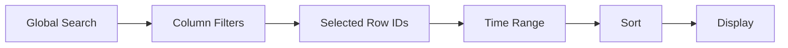

## Overview

Chronos-DFIR provides a professional dark-mode interface optimized for the "Data-Ink Ratio" principle — reducing visual noise while highlighting critical forensic alerts. The filtering system allows surgical isolation of relevant events from timelines containing millions of rows.

<Info>
  All filters compose together: Global Search + Time Range + Column Filters + Row Selection work simultaneously to narrow your investigation scope.
</Info>

## Filter Architecture

Filters operate in **dependency order** (from README.md line 57):



Modifying any filter immediately updates:
- **Grid** (Tabulator virtual DOM)
- **Histogram** (Chart.js timeline)
- **Dashboard cards** (TTPs, risk score, event distribution)
- **TTP Summary Strip** (severity badges + MITRE technique pills)

## Global Search

### How It Works

The global search box performs **substring matching** across all visible columns in the grid.

<Steps>
  <Step title="Enter Search Term">
    Type your query in the global search box (top of interface).
    
    **Features**:
    - **Debounced input**: 300ms delay prevents excessive re-rendering while typing
    - **Case-insensitive**: `powershell` matches `PowerShell`, `POWERSHELL`
    - **Substring match**: `cmd.exe` matches `C:\\Windows\\System32\\cmd.exe`
  </Step>
  
  <Step title="Press Enter to Filter">
    Hit **Enter** or click the search icon.
    
    **Result**:
    - Rows not containing the search term are hidden
    - Matching text is **highlighted in yellow** within cells
    - Histogram updates to show only matching event distribution
    - Dashboard recalculates based on filtered subset
  </Step>
  
  <Step title="Clear Search">
    Delete the search term and press Enter, or click **Reset Filters ⟳**
  </Step>
</Steps>

### Search Examples

<Accordion title="Search for Suspicious Processes">
  **Query**: `powershell -enc`
  
  **Matches**:
  - Rows with `powershell.exe -EncodedCommand` in CommandLine
  - Encoded PowerShell execution (MITRE T1059.001)
  
  **Typical results**: Base64-encoded malicious commands
</Accordion>

<Accordion title="Search for IP Addresses">
  **Query**: `192.168.1.50`
  
  **Matches**:
  - Any column containing the IP (SourceIP, DestinationIP, IpAddress, message fields)
  
  **Use case**: Lateral movement investigation, C2 communication
</Accordion>

<Accordion title="Search for User Accounts">
  **Query**: `svc_admin`
  
  **Matches**:
  - Logon events with TargetUserName = `svc_admin`
  - Process creation by service accounts
  
  **Use case**: Service account abuse, privilege escalation
</Accordion>

<Accordion title="Search for File Paths">
  **Query**: `\\temp\\`
  
  **Matches**:
  - Files accessed/created in temporary directories
  - Suspicious execution from writable locations
  
  **Detection**: T1036 (Masquerading), T1204 (User Execution)
</Accordion>

<Warning>
  Global search does **not** support regex or wildcards. Use exact substring matches.
</Warning>

## Time Range Filtering

### Time Controls

Located above the timeline histogram:

<Steps>
  <Step title="Start Time">
    **Default**: Earliest timestamp in dataset
    
    Click the **Start** datetime picker to set a custom lower bound.
    
    **Format**: `YYYY-MM-DD HH:MM:SS`
  </Step>
  
  <Step title="End Time">
    **Default**: Latest timestamp in dataset
    
    Click the **End** datetime picker to set a custom upper bound.
  </Step>
  
  <Step title="Apply Filter">
    Click **Filter** button to apply the time range.
    
    **Backend processing** (`app.py` line 580):
    ```python
    if start_time:
        df_filtered = df_filtered.filter(pl.col(time_col) >= start_time)
    if end_time:
        df_filtered = df_filtered.filter(pl.col(time_col) <= end_time)
    ```
    
    **Result**:
    - Grid shows only events within the time window
    - Histogram re-renders with new time-bucketing
    - Event count updates: "Showing X / Y events"
  </Step>
</Steps>

### Time Range Use Cases

<Accordion title="Isolate Incident Window">
  **Scenario**: Malware executed at 2024-03-08 14:23:45
  
  **Action**:
  1. Set Start: `2024-03-08 14:00:00` (30 min before)
  2. Set End: `2024-03-08 15:00:00` (30 min after)
  3. Apply filter
  
  **Result**: Timeline focused on 1-hour incident window
</Accordion>

<Accordion title="After-Hours Analysis">
  **Scenario**: Detect activity outside business hours
  
  **Action**:
  1. Filter for `18:00:00` - `08:00:00` range (requires multiple filter applications)
  2. Review processes, logons, network connections
  
  **Common findings**: Scheduled tasks, persistence mechanisms, lateral movement
</Accordion>

<Accordion title="Spike Investigation">
  **Scenario**: Histogram shows massive spike at 14:45
  
  **Action**: Click on histogram bar (future feature) or manually set:
  - Start: `2024-03-08 14:45:00`
  - End: `2024-03-08 14:46:00`
  
  **Analysis**: Sort by EventID to identify bulk events (e.g., brute force attempts, network scanning)
</Accordion>

## Column Filtering

### Filter by Column Values

Click any **column header** in the Tabulator grid to reveal filter options.

<Steps>
  <Step title="Text Column Filters">
    **Available operators**:
    - `=` (equals)
    - `!=` (not equals)
    - `like` (contains substring)
    - `starts` (starts with)
    - `ends` (ends with)
    
    **Example**: Filter `Image` column
    - Operator: `ends`
    - Value: `powershell.exe`
    - Result: Only rows where process path ends with `powershell.exe`
  </Step>
  
  <Step title="Numeric Column Filters">
    **Available operators**:
    - `=`, `!=`, `<`, `<=`, `>`, `>=`
    
    **Example**: Filter `EventID` column
    - Operator: `=`
    - Value: `4624`
    - Result: Only successful logon events (Windows Security Event 4624)
  </Step>
  
  <Step title="Clear Column Filter">
    Click the filter icon again and select "Clear filter"
  </Step>
</Steps>

### Multiple Column Filters

Column filters stack with **AND logic**:

**Example**: Suspicious PowerShell from SYSTEM account
1. Filter `Image` ends with `powershell.exe`
2. Filter `User` equals `NT AUTHORITY\SYSTEM`
3. Filter `CommandLine` like `-enc`

**Result**: Encoded PowerShell execution by SYSTEM (high-confidence indicator)

## Row Selection & Filtering

### Manual Row Selection

Use the **Tag** checkbox column to manually select rows of interest.

<Steps>
  <Step title="Select Rows">
    Click checkboxes for events you want to isolate.
    
    **Features**:
    - **Persistent selection**: Selections survive pagination and AJAX reloads
    - **Cross-page selection**: Select row 5 on page 1, then row 2005 on page 20
    - **Selection count**: Header shows "N rows selected"
  </Step>
  
  <Step title="Apply Row Filter">
    Click **Row Filtering** button (top controls).
    
    **Result** (from README.md line 62):
    > "If during the inspection manual you selected five rows atypical with the check-box (Tag), when you press 'Row Filtering', Tabulator hides all the noise, leaving exclusively your manual selections visible."
    
    **Implementation** (`static/js/grid.js` line 180):
    ```javascript
    // Persistent selection set (survives pagination)
    const _persistentSelectedIds = new Set();
    
    function applyRowSelectionFilter() {
        const idSet = new Set(_persistentSelectedIds);
        ChronosState.selectedIds = Array.from(idSet);
        // Grid reloads with only selected IDs
        reloadGrid();
    }
    ```
  </Step>
  
  <Step title="Export Selected Rows">
    All export formats respect row selection:
    - **CSV**: Only selected rows
    - **Excel**: Only selected rows (formatted with xlsxwriter)
    - **JSON**: Only selected rows (NDJSON format)
    - **HTML Report**: Includes only selected events in timeline summary
    - **PDF**: Reflects selected subset in generated report
  </Step>
</Steps>

<Warning>
  Row selection is exclusive — if rows are selected when you export, **only those rows are exported**. Clear selection (uncheck all) to export the full filtered dataset.
</Warning>

## Hide Empty Columns

The **Hide Empty** toggle is a critical noise-reduction feature (README.md line 63).

### How It Works

<Steps>
  <Step title="Enable Hide Empty">
    Click the **Hide Empty** toggle button.
    
    **Algorithm** (`static/js/grid.js`):
    ```javascript
    function toggleEmptyColumns(hide) {
        table.blockRedraw();  // Batch operation for performance
        
        const columns = table.getColumns();
        const rows = table.getData();  // Current filtered view
        
        columns.forEach(col => {
            if (col.pinned) return;  // Never hide Timestamp, No., Tag
            
            const field = col.getField();
            const allEmpty = rows.every(row => {
                const val = row[field];
                return val === null || val === '' || val === '-' || val === 'nan';
            });
            
            if (allEmpty) {
                col.hide();
            }
        });
        
        table.restoreRedraw();
    }
    ```
    
    **Logic**: Hides columns where **100% of rows** (in the current filtered view) are null, empty, `-`, or `nan`.
  </Step>
  
  <Step title="Dynamic Re-Evaluation">
    **Critical feature**: Hide Empty operates on the **currently filtered dataset**.
    
    **Example scenario**:
    1. Initial dataset: 50,000 Windows Security events
    2. Column `SourceIP` is empty for most events (only populated for Event ID 4624 network logons)
    3. Apply column filter: `EventID = 4624`
    4. Enable **Hide Empty**
    5. Result: `SourceIP` is now visible (populated for logon events), while irrelevant columns like `ServiceName` are hidden
  </Step>
  
  <Step title="Restore All Columns">
    Toggle **Hide Empty** off, or click **Reset Filters ⟳**
  </Step>
</Steps>

### Use Cases

<Accordion title="EVTX with Mixed Event Types">
  **Problem**: Windows Security.evtx contains 20+ event types, each with different EventData fields.
  
  **Solution**:
  1. Filter to Event ID 4688 (Process Creation)
  2. Enable **Hide Empty**
  3. Result: Only process-relevant columns visible (CommandLine, ProcessName, User, ParentProcessName)
  
  **Benefit**: Focus on 8-10 relevant columns instead of 50+ total columns
</Accordion>

<Accordion title="Cross-Source Timeline Analysis">
  **Problem**: Merged timeline from Plaso contains columns from multiple artifact types (MFT, Registry, Prefetch, EVTX).
  
  **Solution**:
  1. Filter by artifact type (e.g., Global Search: `EVTX`)
  2. Enable **Hide Empty**
  3. Result: Only EVTX-specific columns visible
  
  **Alternative**: Filter by time range of interest, then hide empty to see which artifact types have activity
</Accordion>

## Column Management

The **Manage Cols** dropdown provides advanced column organization.

### Top Columns

<Steps>
  <Step title="Select Priority Columns">
    Click **Manage Cols → Top**
    
    A checklist appears with all available columns.
    
    **Select** columns you want to prioritize (e.g., `User`, `Process`, `CommandLine`, `Sigma_Tag`).
  </Step>
  
  <Step title="Apply Positioning">
    Click **Apply** or **Top** button.
    
    **Result** (README.md line 65):
    > "Locates the checked columns in the dropdown and, in a 'Reflow' of grid, radically expels them to the left flank (next to the event timestamp). Displaces less valuable columns to the right."
    
    **Implementation**: Tabulator `moveColumn()` API reorders columns dynamically.
  </Step>
</Steps>

**Use case**: Investigating process execution → Top: `CommandLine`, `Image`, `User`, `ParentImage`

### Filter Columns (Column Visibility)

<Steps>
  <Step title="Select Visible Columns">
    Click **Manage Cols → Filter Cols**
    
    Checklist appears (all columns unchecked by default means "show all").
    
    **Check only** the columns you want to display.
  </Step>
  
  <Step title="Apply Filter">
    Click **Apply** or **Filter Cols**.
    
    **Result** (README.md line 66):
    > "Eliminates physically any other column from the Grid that has not been explicitly requested and sorts in the same mode to the left."
    
    **Effect**: All unchecked columns are hidden. Only selected columns remain visible, positioned left.
  </Step>
</Steps>

**Use case**: Focused analysis on 5-6 key columns, hiding 40+ noise columns

<Warning>
  **Filter Cols** is more aggressive than **Hide Empty** — it hides columns even if they contain data. Use **Reset Filters ⟳** to restore all columns.
</Warning>

## Advanced Filtering Workflows

### Composition Example: Lateral Movement Investigation

<Steps>
  <Step title="Identify Suspicious Account">
    **Global Search**: `svc_sql`
    
    **Result**: 2,500 events involving service account
  </Step>
  
  <Step title="Filter to Logon Events">
    **Column Filter** on `EventID`:
    - Operator: `=`
    - Value: `4624`
    
    **Result**: 340 successful logons
  </Step>
  
  <Step title="Filter to Network Logons">
    **Column Filter** on `LogonType`:
    - Operator: `=`
    - Value: `3`
    
    **Result**: 85 network logons (lateral movement candidates)
  </Step>
  
  <Step title="Enable Hide Empty">
    **Action**: Toggle **Hide Empty**
    
    **Result**: Only columns relevant to network logons visible (SourceIP, SourceWorkstation, TargetUserName, Computer)
  </Step>
  
  <Step title="Top Columns for Analysis">
    **Manage Cols → Top**: Select `SourceIP`, `Computer`, `TargetUserName`
    
    **Result**: Key lateral movement indicators positioned left for easy scanning
  </Step>
  
  <Step title="Review Timeline">
    Sort by `Timestamp` (click column header).
    
    **Analysis**: Identify source machines and lateral movement paths
  </Step>
  
  <Step title="Export Evidence">
    **Selected rows**: Check suspicious logon events
    
    **Export**: CSV or Excel (only selected rows exported)
    
    **Result**: Clean evidence file for reporting
  </Step>
</Steps>

### Performance Considerations

<Info>
  **Tabulator Virtual DOM**: Only renders visible rows (typically 50-100 at a time). Filtering 1 million events down to 500 is nearly instantaneous because the grid never renders the full dataset.
</Info>

**Backend filtering** (`app.py` → `/api/data/{filename}`):
- **Polars vectorized expressions**: Column filters and global search use Polars `filter()` expressions (C++ implementation via PyArrow)
- **Remote pagination**: Grid requests data in chunks (default: 100 rows per page)
- **Sort offloading**: Sorting happens server-side, not in browser

**Recent optimizations** (v177 fixes):
- `blockRedraw()` / `restoreRedraw()` wrapper for batch column operations (50 columns = 1 redraw instead of 50)
- Debounced dashboard refresh (1200ms delay after filter change to prevent excessive API calls)
- Histogram debounce on selection changes (400ms)

## Filter State Management

### Reset Filters

Click **Reset Filters ⟳** to clear:
- Global search query
- Column header filters
- Row selection (but preserves selected IDs if not in selection view mode)
- Hide Empty state

**Does NOT reset**:
- Time range (cleared separately via time controls)
- Column visibility from **Filter Cols** (use **Manage Cols** dropdown to restore)

### Filter Persistence

**Current behavior**: Filters are **session-only** (cleared on page refresh).

**Roadmap** (Etapa 3 - Case Management UI):
- Save filter configurations per case
- Named filter presets (e.g., "Lateral Movement Filter", "PowerShell Execution Filter")
- Share filter configurations across team

## Keyboard Shortcuts

<Info>
  Future feature — planned for v186+
</Info>

**Proposed shortcuts**:
- `Ctrl+F` / `Cmd+F`: Focus global search
- `Ctrl+R` / `Cmd+R`: Reset filters
- `Ctrl+H` / `Cmd+H`: Toggle Hide Empty
- `Ctrl+E` / `Cmd+E`: Export filtered data

## Next Steps

<CardGroup cols={2}>
  <Card title="Detection Rules" icon="shield-halved" href="/guides/detection-rules">
    Learn how Sigma and YARA rules automatically tag malicious activity
  </Card>
  
  <Card title="Case Management" icon="folder-open" href="/guides/case-management">
    Organize multi-file investigations with journal entries and cross-file correlation
  </Card>
  
  <Card title="Evidence Ingestion" icon="file-arrow-up" href="/guides/evidence-ingestion">
    Return to ingestion guide for supported file formats and troubleshooting
  </Card>
</CardGroup>